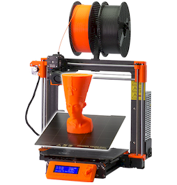
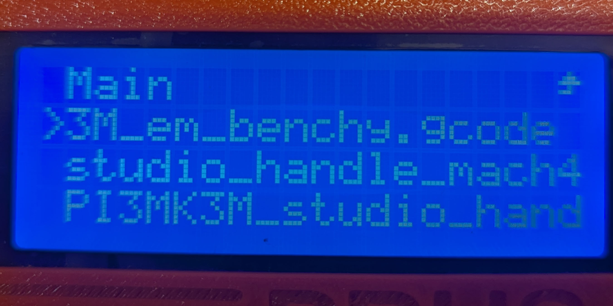

# 3d-printers of SFCI
The STUDIO for Creative Inquiry currently has 2 operational FDM 3D printers. Access to the printers is granted by STUDIO staff with explicit permission. 

| Printer | Material | filament size |
| ------- | -------- | ------------------------ |
| [Prusa i3 MK3](#Prusa-i3-MK3) | PLA | 1.75mm |
| [Ultimaker 2 Extended+](#ultimaker-2) | PLA | 2.85mm |

# Prusa i3 MK3 
 

[**I3-MK3Manual**](https://www.prusa3d.com/downloads/manual/prusa3d_manual_mk3s_en_3_11.pdf) 

[**STUDIO training video**](https://youtu.be/qqQw82fDXAU?si=rbnTzovR6jqMPehH)( an offline copy of the video sits in this repository)

## Loading and Unloading Filament
### Loading
The Prusa should be in `Autoload` mode at all times meaning all you have to do to load new filament in the machine is hand-guide filament through the hotend until you hear a beep.  

This prompts the hotend to heat and ask what kind of filament you would like to use. Please select:

| Material | Bedtemp |Nozzle |
| ------- | -------- | ------------------------ |
| PLA | 60F | 215F |

When the printer beeps next it will be at this temp and you can guide new filament through until it comes out of the nozzle in the correct colord
### Unloading
Clicking the dial in and going to `Unload` should take us to the same temperature setting menu we saw earlier, this time heating up to release melted filament in the hotend. 

Upon the next beep, the hotend will be 200F and the servos will spin in the upward direction to push filament back out of the top of the machine.
## Print from SD

## Manual Manipulation

## Calibration

## ⚠ Troubleshooting ⚠
### Clogs
Clogs can take many shapes and forms.The most common symptom of a clog is that filament pushed through the top of the hotend while 'loading filament' does not back it through the nozzle. If the path of the filament is blocked there are a few steps we can take to resolve this. 
1. Heat the nozzle manually to 240F 
2. Take one of the `declogging needles` and slowly insert into the hotend from the bottom of the Prusa's nozzle
3. Repeatedly jam the needle in and out of the nozzle until the needle passes through the clog, breaking it up, or filament stuck in the lower part of the nozzle seeps out. 

the above nozzle works best for small clogs that block a tiny part of the hotend canal

### Bed Adhesion
Bed adhesion is a common issue with prints that can be noticeable in the first few minutes of printing. It is such a common occurence because it can have many causes In the next few bullets I will list a few causes and how they can be remedied 

- **Adhesion type** in Cura : In cura when we slice a 3d model into a g-code file, we choose to generate a type of support called bed adhesion. We typically want to use either a `brim` or a `raft`. 
  - A brim is a series of offset curves drawn from where the bottom of a model touches the build-plate. This ensures that the first layer has a lot of surface area in contact with the bed, and hence better bed adhesion. 
  - A raft is the same concept, except more layers are added to the brim, and the whole model sits on top of the raft, giving better bed adhesion. As you can imagine this takes up more plastic and more time, but are often well worth the material.  
  
- **Glue** : rubbing a glue stick on the built-plate can give plastic coming out of the nozzle, a more textured surface to print on. This traction allows the first few layers of a print some more surface area to cling to while cooling. Too much texture can interrupt the path of the nozzle, but if you aren't already, a freshly applied, thin layer of glue should be enough traction to get a print started. 
  
- **Nozzle Height** : If the above attempts do not work, you may want to do a `First Layer Calibration` under the **Calibration** menu of the printer. If the nozzle is too high above where it is supposed to be depositing filament, it can pull filament away from the build-plate before it is properly cooled. By running a first layer calibration and manually shifting the nozzle with `live adjust z`, this problem will be minimized.
- **Bed Temperature** : If the bed temperature is set too low, then it is possible the plastic is cooling too quickly, and is not adhering to the build-plate. By making the build-plate 5-8F warmer, the cooling will be slower and the plastic is able to be in a liquid state when it comes into contact with the bed. 
>**Note**: Increasing the build-plate temperature can make prints begin to curl at the bottom. If it is imperative that a print be perfect at it's base, it is suggested to instead increase the `nozzle temperature` slightly. This will yeild similar results with no curling.
### Thermistor cable

# Ultimaker 2 